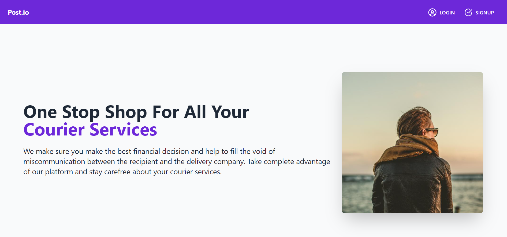
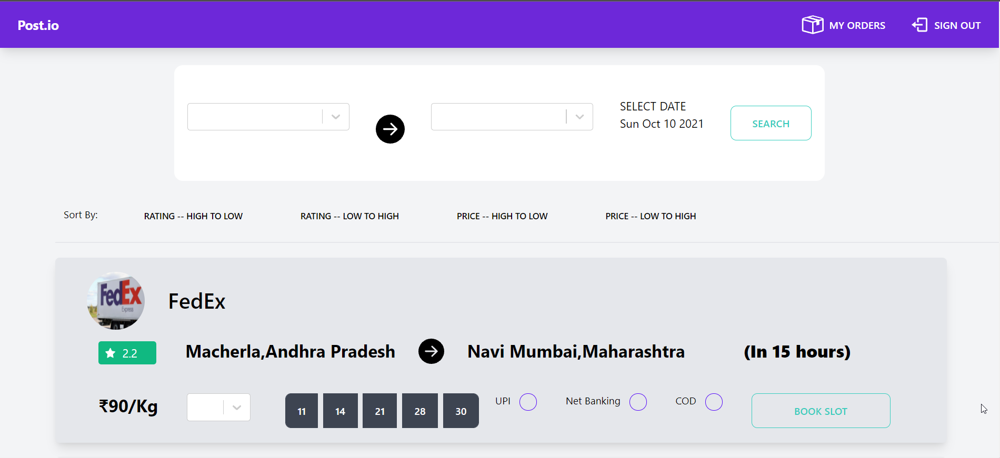
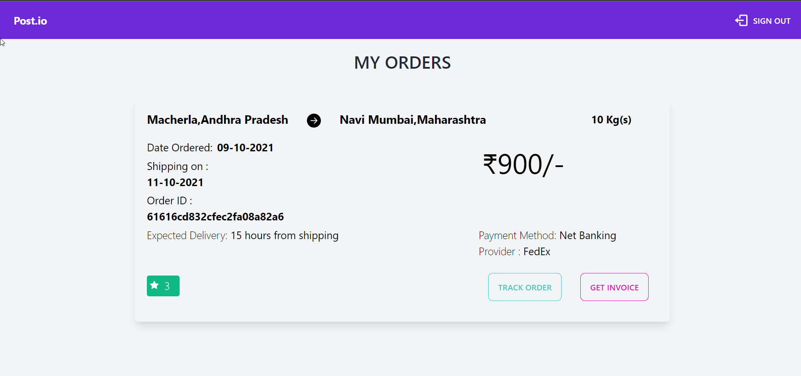
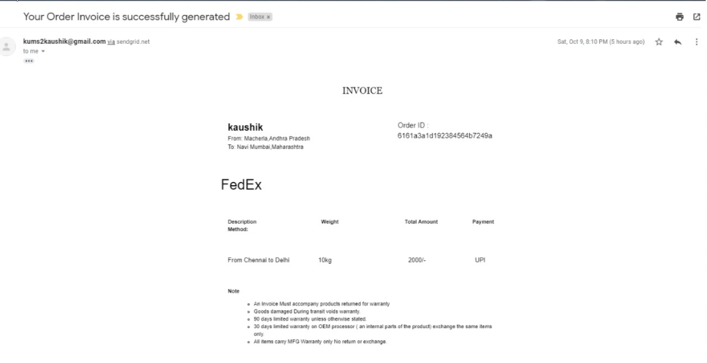
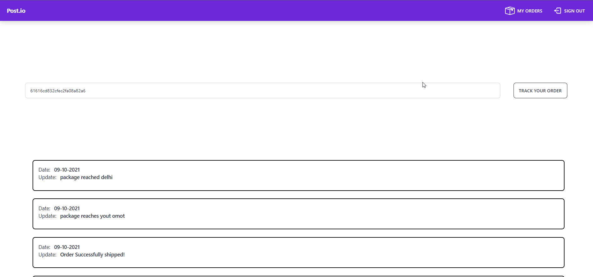

# Logistico
## The Problem We Solve
1. Many different service providers set different prices for the service and we help the client pick the appropriate service by letting them compare the prices.
2. We have a centralized tracking platform from where users can track their orders across multiple service providers
3. We provide various parameters to be compared such as estimated time delivery, multi available dates basis of rate, service rating, and transit time.
4. We have unique dashboards for both the consumer and the service providers with exclusive features. For example, the service provider is able to manage and update the status of the user's orders.
5. Once the booking is confirmed, the consumer will receive an invoice to their registered mail ID will all the details such as the order id, consumer's details and list of couriers requested
## Screenshots
### 
<b>Homepage</b>

  

### 
<b>User Dashboard</b>

  

### 
<b>My Orders</b>

  

### 
<b>Invoice (Received via mail)</b>

  

### 
<b>Track Package</b>

  

